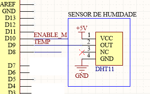
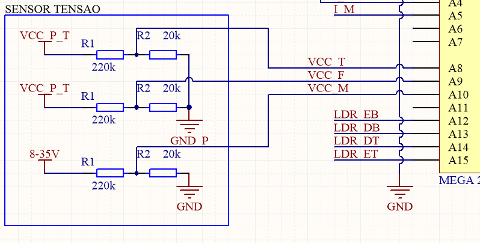
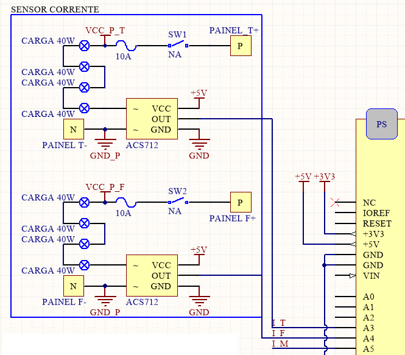
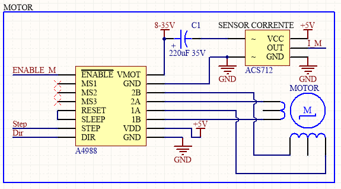
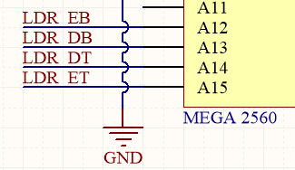

# Tracker
## Circuito completo


## Pinos utilizados
 - DHT11 = pino digital 9
 - Sensor de tensão tracker = pino analogico A8
 - Sensor de tensão fixo = pino analogico A9
 - Sensor de tensão motor = pino analogico A10
 - Sensor de corrente tracker = pino analogico A3
 - Sensor de corrente fixo = pino analogico A4
 - Sensor de corrente motor = pino analogico A5
 - Fim de curso 1 = pino digital 2
 - Fim de curso 2 = pino digital 3
 - RTC SDA = pino digital 20
 - RTC SLC = pino digital 21
 - Motor step = pino digital 7
 - Motor dir = pino digital 8
 - LDR esquerda baixo = pino analógico A12
 - LDR esquerda topo = pino analógico A15
 - LDR direita baixo = pino analógico A13
 - LDR direita topo = pino analógico A14

## DHT11
 - Foi utilizado a biblioteca dht11 para facilitar a leitura da umidade e temperatura;
 - O sensor dht11 está sendo lido no pino digital 9;
 - A leitura do sensor está dentro da função readSensors() que está sendo chamada dentro do loop;
### Esquemático


NÃO COLOCAR RESISTOR para o dht11 que só possui 3 terminais

## Sensor de Tensão
 - Foi utilizado um divisor de tensão que permite ler uma tensão de até 60V;
 - Para esse circuito foram utilizados um resistor de 220KΩ (R1) e um resistor de 20KΩ (R2);
 - Os sensores de tensão estão conectados nas entradas:
   - A8: Tracker;
   - A9: Fixo;
   - A10: Motor;
 - O valor da tensão é calculado pela função readVoltage
### Esquemático


## Sensor de corrente
 - Foi utilizado o sensor ACS712-30A
 - Os sensores de corrente estão conectados nas entradas:
   - A3: Tracker;
   - A4: Fixo;
   - A5: Motor;
 - O valor da corrente é calculado pela função readCurrentSensor

###Esquemático



## Motor
 - Será conectado aos pinos digitais 7 e 8;
 - É preciso testar para ver quantos pulsos será preciso para cada angulo, Os valores dos pulsos deverão ser colocados nas váriaveis:
   ```
   const int revolution15Degress = 100 // valores de exemplo
   const int revolution20Degress = 150
   const int revolution30Degress = 200
   const int revolution50Degress = 300
   ```
## Armazenamento de dados
 - Foi utilizado o cartão SD para o armazenamento de dados;
 - Foi utilizado o pino digital 4;

## RTC
 - Exclui a implementação utilizando a biblioteca de RTC;
 - fiz uma nova implementação utilizando a biblioteca Wire e tratando o valor recebido do RTC com comunicação I2C;

## Ajuste fino



 - Para instalar os LDR's é preciso "escolher" quais serão os 2 LDR's da direita e quais serão da esquerda pois o calculo do ajuste fino será comparando os LDR's da direita com os da esquerda;
 - No momento da instalação é necessário verificar a direção do motor, pois no código assumi que a direção HIGH é para a direita e a direção LOW é para a esquerda;

## Referências
 - dht11: https://create.arduino.cc/projecthub/arcaegecengiz/using-dht11-b0f365

 - Sensor de tensão: https://br-arduino.org/2015/06/voltimetro-com-arduino-como-montar-programar-e-calibrar.html

 - Sensor de corrente: https://www.electronicshub.org/interfacing-acs712-current-sensor-with-arduino/

 - Motor : https://www.robocore.net/tutoriais/controlando-motor-de-passo

 - Armazenamento de dados: https://scholarslab.lib.virginia.edu/blog/saving-arduino-sensor-data/

 - RTC: http://projectsfromtech.blogspot.com/2013/06/arduino-rtc-tinyrtc-v1-with-arduino.html

 - LDR: https://www.filipeflop.com/universidade/kit-maker-arduino/projeto-10-sensor-de-luz-ambiente/
